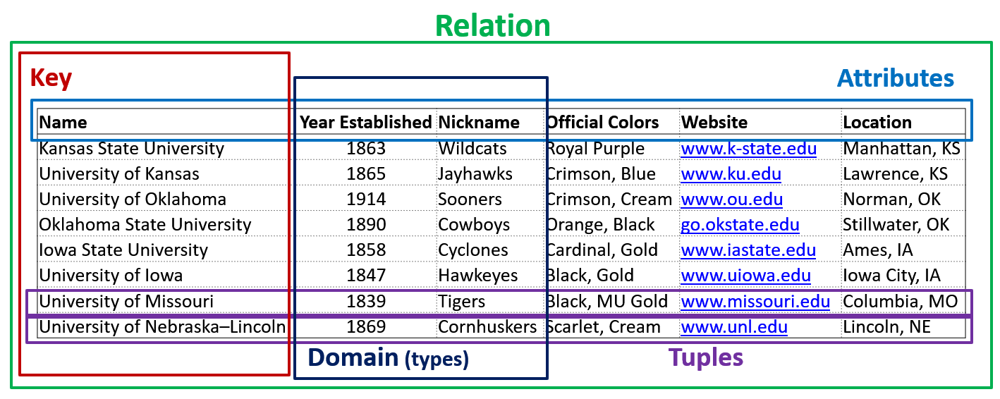



## Example Data

<iframe width="1000" height="300" frameborder="0" scrolling="no" src="https://ksuemailprod.sharepoint.com/sites/ComputationalCoreFaculty/_layouts/15/Doc.aspx?sourcedoc={5b03669c-2c80-41c6-8aa9-3f20a6d936f3}&action=embedview&ActiveCell='ExampleData'!A2&wdHideGridlines=True&wdDownloadButton=True&wdInConfigurator=True"></iframe>

Here we can see some basic information about universities in a table.  Much of the data we use in relational databases resemble this format, except the information is  typically at a much larger scale.  A lot of situations find this data being stored in spreadsheets, comma separated value (csv) files, and alike; however, these formats have limited capability in manipulating and storing data.  Spreadsheet applications can do some of this type of work, but there are limits...particularly in terms of scalability, accessibility, and reliability.  That is where relational databases come into play!

### Operations

In mathematics, when we perform operations on numbers, we get numbers as a result.  So in databases, when we perform operations on datasets, we can get new datasets as a result.  The vast majority of operations we perform on a database will be done in the form of a **query**.  Think of a query as a question that we would like answered about some data or **entity**.  The word **entity** can be used to describe a single record about something contained in a database, like one single student record.  We can extract entities using a query with three primary database operations: **selection**, **projection**, and **join**.

{}

The term **entity** may be used interchangeably with *records* and *rows* in certain scenarios; however, at their core, they don't always mean the same thing. 

{}

- **Selection** is used to extract a specific subset of **rows** that match a certain predicate (condition).  This operation acts like a *filter* for querying data. The highlighted rows below are from *selecting* universities where the 'Year Established' is on or before 1863.

  [INSERT IFRAME WITH TABLE HERE]

- **Projection** is used to extract a specific subset of **columns**.  This operation chooses which parts of the data are used.  The columns that are chosen based off of the provided column names.  The highlighted columns in the table below represent the *projection* of the columns 'Name', 'Nickname', 'Website', and 'Location'.  Note that when *projection* is used without *selection*, all rows of data are included.

  [INSERT IFRAME WITH TABLE HERE]

- **Join** is used to combine data from multiple datasets.  There are different types of joins that we will talk about...but when tables are joined, not all data has to be included in the operation.  In the example below, you can see how the 'School' dataset can be joined with parts of the 'Conferences' dataset to create a new dataset all together.

  [INSERT IFRAME WITH TABLE HERE]

{}

The operations **selection** and **projection** can be a bit confusing at first...but not in what the operations actually do.  The confusion comes from the SQL language syntax.  The `SELECT` statement in SQL is actually the **projection** operation and the `WHERE` statement is one of multiple ways to do a **selection** operation in SQL.

{}

## Relational Vocabulary

There are a lot of terms that are used when working with databases.  Some words can be used interchangeably.  

- **Relations**: Two-dimensional tables, each with rows and columns.
- **Attributes**: The columns of the relation. *The attributes are a set, not a list.*
- **Tuples**: The rows in the relation. *The tuples are a set, not a list.*
- **Domain**: An elementary type for each attribute. A value must not be a set, list, array, etc.
- **Keys**: A set of attributes that prevent two tuples in the relation to have the same values in all the key attributes.

- Combining the above concepts into a complete database design is the **database schema**.

